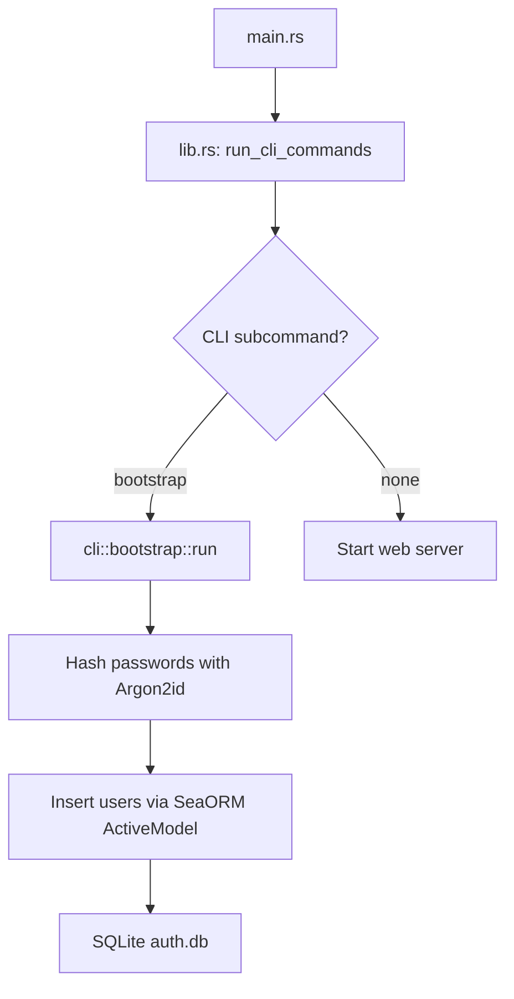

# Design Document: Simplified Bootstrap

## Overview

Replaces the entire `src/cli/` module with a minimal bootstrap command that writes three hardcoded seed users directly to SQLite via SeaORM. Bypasses all coordinator/provider/store layers. This is a temporary solution while the architecture is being refactored — the full CLI will be rebuilt later.

Only `src/cli/`, `src/lib.rs`, and `src/main.rs` are modified. If compile errors remain outside these files after the change, they are reported to the developer without being fixed.

## Architecture



The bootstrap function receives a `&DatabaseConnection` from `AppData.connections.auth` and performs direct SeaORM `ActiveModel` inserts. No stores, providers, or coordinators are involved.

## Key Design Decisions

1. **Direct DB access** — The bootstrap takes `&DatabaseConnection` and uses `ActiveModel::insert()` directly. This intentionally violates the layered architecture because the layers are in flux.

2. **Hardcoded credentials** — Three users with fixed usernames/passwords defined as constants. Passwords printed to console after seeding.

3. **Idempotent via username lookup** — Before inserting each user, query by username. If found, skip and print a message. Avoids unique constraint violations.

4. **Minimal CLI surface** — `Cli` struct keeps only `--env-file` and an optional `bootstrap` subcommand. All other subcommands removed.

5. **In-module password hashing** — Argon2id hashing done inline using `argon2` and `rand_core` crates already in `Cargo.toml`. No dependency on `CryptoProvider`.

6. **No tests** — This is throwaway transitional code. Verification is done via manual testing (`cargo run bootstrap` then check the database).

## Components and Interfaces

### Module: `src/cli/mod.rs`

Replaces the current multi-file CLI module with a single file plus a `bootstrap` submodule. All other submodules (`credential_export`, `owner`, `password_management`, `old/`) are deleted.

```rust
#[derive(Parser)]
#[command(name = "linkstash")]
pub struct Cli {
    #[arg(long, global = true, default_value = ".env")]
    pub env_file: String,

    #[command(subcommand)]
    pub command: Option<Commands>,
}

#[derive(Subcommand, Debug)]
pub enum Commands {
    Bootstrap,
}

pub async fn execute_command(
    command: Commands,
    app_data: &AppData,
) -> Result<(), Box<dyn std::error::Error>>;
```

### Module: `src/cli/bootstrap.rs`

Single public entry point:

```rust
pub async fn run(db: &DatabaseConnection) -> Result<(), Box<dyn std::error::Error>>;
```

Internal components:
- `SEED_USERS: [SeedUser; 3]` — Array of hardcoded user definitions
- `SeedUser` — Struct with `username`, `password`, `is_owner`, `is_system_admin`, `is_role_admin`
- `hash_password(password: &str) -> Result<String>` — Hashes with Argon2id using random salt
- `user_exists(db: &DatabaseConnection, username: &str) -> Result<bool>` — Checks if username already exists

### Changes to `src/lib.rs`

- The `seed_test_user` function (already commented out) can be removed
- `run_cli_commands` simplified to only match `Commands::Bootstrap`
- Remove any imports referencing deleted CLI submodules

### Changes to `src/main.rs`

No structural changes needed. `main.rs` already calls `run_cli_commands` which delegates to the CLI module. The flow remains identical.

## Data Models

### Existing Entity: `types::db::user::Model`

The bootstrap writes directly to the `users` table using the existing SeaORM entity at `src/types/db/user.rs`:

| Field | Type | Bootstrap Value |
|---|---|---|
| `id` | `String` | `Uuid::new_v4().to_string()` |
| `username` | `String` (unique) | Hardcoded per user |
| `password_hash` | `Option<String>` | `Some(argon2id_hash)` |
| `created_at` | `i64` | `chrono::Utc::now().timestamp()` |
| `is_owner` | `bool` | Per user definition |
| `is_system_admin` | `bool` | Per user definition |
| `is_role_admin` | `bool` | `false` for all |
| `app_roles` | `Option<String>` | `None` |
| `password_change_required` | `bool` | `false` |
| `updated_at` | `i64` | Same as `created_at` |

### Hardcoded Seed Users

| Username | Password | is_owner | is_system_admin | is_role_admin |
|---|---|---|---|---|
| `owner` | `owner-dev-password-change-me` | true | false | false |
| `admin` | `admin-dev-password-change-me` | false | true | false |
| `user` | `user-dev-password-change-me` | false | false | false |

## Files to Delete

All files inside `src/cli/` except `mod.rs` (which gets rewritten):
- `src/cli/bootstrap.rs` (rewritten, not deleted)
- `src/cli/credential_export.rs`
- `src/cli/owner.rs`
- `src/cli/password_management.rs`
- `src/cli/old/` (entire directory)

## Error Handling

| Scenario | Handling |
|---|---|
| Database connection failure | Propagate `DbErr` as `Box<dyn Error>`, print to stderr, exit code 1 |
| Argon2id hashing failure | Propagate error, print to stderr, exit code 1 |
| Username already exists | Skip the user, print "skipped" message, continue |
| Partial failure mid-insert | Print error, return. Already-inserted users remain — idempotent re-run skips them |
| Compile errors outside CLI | Report to developer, do not fix |

No transaction wrapping needed — the operation is idempotent.

## Verification

Manual testing only:
1. `cargo build` — verify compilation
2. Delete `auth.db`, run `cargo run bootstrap` — verify 3 users created with correct flags
3. Run `cargo run bootstrap` again — verify idempotent (skips existing users)
4. `cargo run` (no subcommand) — verify server starts normally
