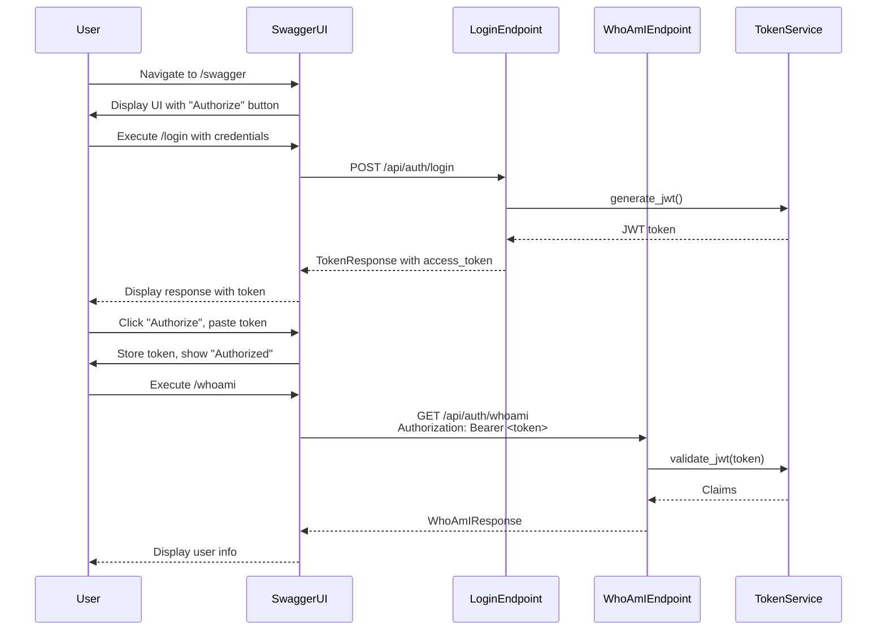
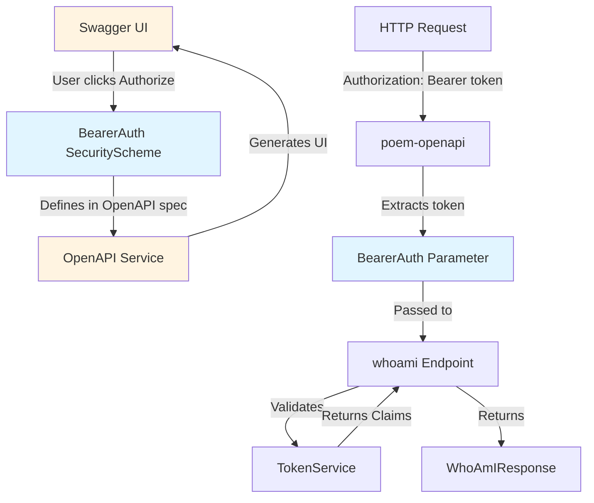
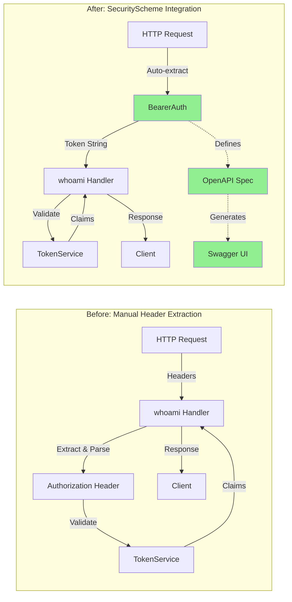

# Design Document

## Overview

This design adds JWT Bearer authentication support to the Swagger UI by implementing poem-openapi's `SecurityScheme` feature. The implementation will define a Bearer token security scheme in the OpenAPI specification and apply it selectively to the `/whoami` endpoint, while keeping `/login` and `/refresh` endpoints public.

The key insight is that poem-openapi provides a declarative way to define security schemes that automatically:
- Adds an "Authorize" button to Swagger UI
- Shows lock icons on protected endpoints
- Injects the Authorization header into requests
- Extracts and validates the token in endpoint handlers

## Architecture

### Current State

Currently, the `/whoami` endpoint manually extracts and validates the JWT from the `Authorization` header using `HeaderMap`:

```rust
async fn whoami(&self, headers: &HeaderMap) -> Result<Json<WhoAmIResponse>, AuthError> {
    let auth_header = headers.get("authorization")...
    let token = &auth_header[7..]; // Skip "Bearer "
    let claims = self.token_manager.validate_jwt(token)?;
    // ...
}
```

This approach works but doesn't integrate with OpenAPI's security scheme system, so Swagger UI has no way to know this endpoint requires authentication.

### Target State

After implementation, the `/whoami` endpoint will use poem-openapi's `SecurityScheme` for automatic token extraction:

```rust
#[derive(SecurityScheme)]
#[oai(
    ty = "http",
    scheme = "bearer",
    bearer_format = "JWT"
)]
struct BearerAuth(String);

async fn whoami(&self, auth: BearerAuth) -> Result<Json<WhoAmIResponse>, AuthError> {
    let claims = self.token_manager.validate_jwt(&auth.0)?;
    // ...
}
```

The security scheme will be defined once and applied only to endpoints that need it.

## Components and Interfaces

### 1. BearerAuth Security Scheme

**Location:** `src/api/auth.rs`

**Definition:**
```rust
use poem_openapi::SecurityScheme;

/// JWT Bearer token authentication
#[derive(SecurityScheme)]
#[oai(
    ty = "http",
    scheme = "bearer",
    bearer_format = "JWT",
    description = "Enter your JWT access token (without 'Bearer ' prefix)"
)]
pub struct BearerAuth(pub String);
```

**Attributes:**
- `ty = "http"` - Uses HTTP authentication
- `scheme = "bearer"` - Specifies Bearer token scheme
- `bearer_format = "JWT"` - Documents that tokens are JWTs
- `description` - User-facing help text in Swagger UI

**Behavior:**
- Automatically extracts token from `Authorization: Bearer <token>` header
- The inner `String` contains just the token (without "Bearer " prefix)
- If header is missing or malformed, poem returns 401 before reaching the handler

### 2. Updated whoami Endpoint

**Current Signature:**
```rust
async fn whoami(&self, headers: &HeaderMap) -> Result<Json<WhoAmIResponse>, AuthError>
```

**New Signature:**
```rust
#[oai(path = "/whoami", method = "get", tag = "AuthTags::Authentication")]
async fn whoami(&self, auth: BearerAuth) -> Result<Json<WhoAmIResponse>, AuthError>
```

**Changes:**
- Replace `headers: &HeaderMap` parameter with `auth: BearerAuth`
- Remove manual header extraction and parsing logic
- Access token directly via `auth.0`
- Endpoint automatically marked as requiring authentication in OpenAPI spec

### 3. Unchanged Endpoints

**login and refresh endpoints:**
- No changes to signatures or implementations
- Do NOT add `BearerAuth` parameter
- Do NOT add security attribute
- Remain publicly accessible in Swagger UI

## Data Models

No new data models are required. The existing DTOs remain unchanged:
- `LoginRequest` / `TokenResponse`
- `RefreshRequest` / `RefreshResponse`
- `WhoAmIResponse`

The `BearerAuth` struct is a security scheme wrapper, not a DTO.

## Error Handling

### Automatic Error Handling by poem-openapi

When a request to a protected endpoint is missing the Authorization header or has a malformed header:
- poem-openapi automatically returns 401 Unauthorized
- The endpoint handler is never called
- No custom error handling needed for missing/malformed headers

### Manual Error Handling in Endpoint

The endpoint still needs to handle JWT validation errors:

```rust
async fn whoami(&self, auth: BearerAuth) -> Result<Json<WhoAmIResponse>, AuthError> {
    // Token extraction is automatic, but validation is manual
    let claims = self.token_manager.validate_jwt(&auth.0)?;
    
    // Return user info
    Ok(Json(WhoAmIResponse {
        user_id: claims.sub,
        expires_at: claims.exp,
    }))
}
```

**Error Cases:**
- Invalid JWT signature → `AuthError::InvalidToken`
- Expired JWT → `AuthError::ExpiredToken`
- Malformed JWT → `AuthError::InvalidToken`

These errors are already handled by `TokenService::validate_jwt()` and properly converted to HTTP responses via `AuthError`'s `ResponseError` implementation.

## Testing Strategy

### Unit Tests

**Test Coverage:**
1. Existing tests continue to work with minimal modifications
2. Tests that manually create `HeaderMap` need to be updated to pass `BearerAuth` directly
3. Tests for missing/malformed headers can be simplified or removed (poem handles this)

**Test Modifications Required:**

```rust
// OLD: Manual header creation
let mut headers = HeaderMap::new();
headers.insert("authorization", format!("Bearer {}", token).parse().unwrap());
let result = api.whoami(&headers).await;

// NEW: Direct BearerAuth construction
let auth = BearerAuth(token);
let result = api.whoami(auth).await;
```

**Tests to Keep:**
- Valid JWT returns 200 with user info
- Invalid JWT returns 401
- Expired JWT returns 401

**Tests to Remove/Simplify:**
- Missing Authorization header (poem handles automatically)
- Malformed Authorization header (poem handles automatically)

### Manual Testing

**Test Workflow:**
1. Start server with `cargo run`
2. Navigate to http://localhost:3000/swagger
3. Verify "Authorize" button appears in top-right corner
4. Click "Authorize" button
5. Verify modal shows input field for Bearer token
6. Execute `/login` endpoint with credentials (testuser/testpass)
7. Copy `access_token` from response
8. Paste token into "Authorize" modal and click "Authorize"
9. Verify lock icon on `/whoami` endpoint appears locked/highlighted
10. Execute `/whoami` endpoint
11. Verify 200 response with user information
12. Click "Logout" in Authorize modal
13. Execute `/whoami` again
14. Verify 401 response

**Expected Swagger UI Behavior:**
- `/login` endpoint: No lock icon, always accessible
- `/refresh` endpoint: No lock icon, always accessible
- `/whoami` endpoint: Lock icon present, requires authentication

## Implementation Notes

### Minimal Code Changes

The implementation requires changes to only one file:
- `src/api/auth.rs` - Add `BearerAuth` struct and update `whoami` endpoint

No changes needed to:
- DTOs in `src/types/dto/auth.rs`
- `TokenService` in `src/services/token_service.rs`
- `CredentialStore` in `src/stores/credential_store.rs`
- `main.rs` server setup

### Backward Compatibility

The API behavior remains identical from a client perspective:
- Same endpoints at same paths
- Same request/response formats
- Same authentication mechanism (Bearer token in Authorization header)
- Same error responses

The only change is enhanced OpenAPI documentation and Swagger UI functionality.

### poem-openapi Version Compatibility

This design assumes poem-openapi 5.1.x as specified in the tech stack. The `SecurityScheme` derive macro and `#[oai]` attributes are stable features in this version.

## Alternative Approaches Considered

### Alternative 1: Global Security Requirement

Apply security to all endpoints by default and explicitly mark public endpoints:

```rust
#[OpenApi(prefix_path = "/auth", security = "BearerAuth")]
impl AuthApi {
    #[oai(path = "/login", method = "post", security = [])]  // Override to public
    async fn login(...) { }
    
    #[oai(path = "/whoami", method = "get")]  // Inherits security
    async fn whoami(...) { }
}
```

**Rejected because:**
- More verbose (need to mark 2 public endpoints vs 1 protected endpoint)
- Less explicit (security is inherited rather than declared)
- Harder to understand which endpoints are public

### Alternative 2: Custom Middleware

Implement authentication as Poem middleware instead of using SecurityScheme:

**Rejected because:**
- Doesn't integrate with OpenAPI spec
- No automatic Swagger UI support
- More code to maintain
- Loses type safety of SecurityScheme

### Alternative 3: Keep Manual Header Extraction

Keep current implementation and add OpenAPI security annotations separately:

**Rejected because:**
- Duplicates logic (manual extraction + OpenAPI annotations)
- Error-prone (annotations can get out of sync with implementation)
- Misses benefits of automatic token extraction

## Mermaid Diagrams

### Authentication Flow in Swagger UI



### Component Interaction



### Before vs After Architecture


